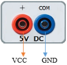
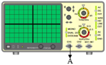
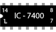
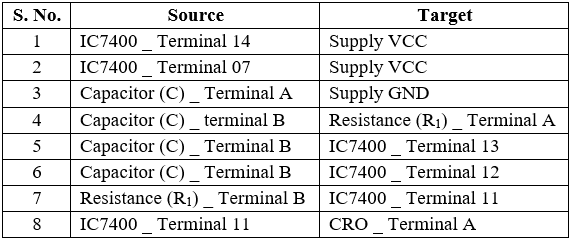

## Procedure
 

1.  Click on the **Component** button to place components on the table.

  

&emsp; &emsp; &emsp; &emsp; ")&emsp; ")   

**Fig. 1 Components** 

  
2.  Make connections as per the circuit diagram and pin diagram of IC or according to connection table.
3.  Connect the C.R.O on output terminal of circuit (Refer connection table).
  

**Fig. 2 Circuit diagram of clock pulse using NAND gate**

**Fig. 3 Pin diagram of IC 7400**  

**Table 1: Connection table**

  

  
4.  Click on **Check Connections** button. If connections are right, click on **‘OK’**, then **Simulation** will become active.
5.  Connect CH1/CH2 of C.R.O. to output terminal of the circuit.
6.  Observe output wave on C.R.O by adjusting C.R.O channel **CH1/CH2** and **TIME** knobs.
7.  Use **X** Shift and **Y** Shift buttons for wave shifting.
8.  Measure the time period of output wave at C.R.O. and calculate the frequency by feeding the time period in the given box.
9.  Compare both experimental and theoretical frequencies.
10.  Click on the **Reset** button to reset the page.

