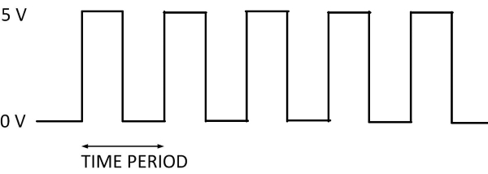
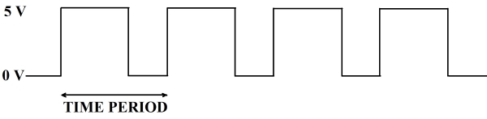
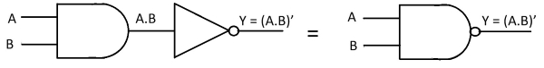
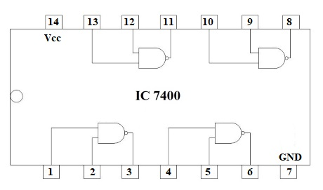
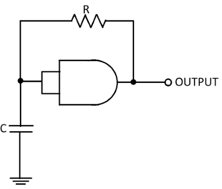
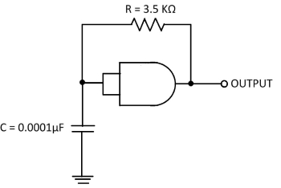
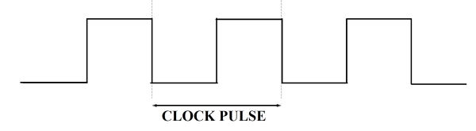

### Introduction

Timing components are one of the most ubiquitous components in electronics. Since all logic operations in a synchronous machine occur in synchronism with a clock, the system clock becomes the basic timing unit. The system clock must provide a periodic wave form that can be used as a synchronous signal. The square waveform is a typical clock waveform used in a digital system. A clock generator is a circuit that produces a timing signal (known as a clock signal) for use in synchronizing a circuit's operation. The signal can range from a simple symmetrical square wave to more complex arrangements.

Clock signal is a periodic signal that oscillates between a high and a low state. It’s ON time and OFF time need not be the same. The signal acts like a metronome which the digital circuit follows in time to coordinate its sequence of actions. Digital circuits rely on clock signals to know when and how to execute the functions that are programmed.

The clock signal can be represented as a square wave when both its ON time and OFF time are same (As shown in Fig. 1). This clock signal is shown in the following figure.

  
  

**Fig. 1 clock signal when both its ON time and OFF time are same** 

  

This signal stays at logic High (5 V) for some time and stays at logic Low (0 V) for equal amount of time. This pattern repeats with some time period. In this case, the time period will be equal to either twice of ON time or twice of OFF time.  
The clock signal can be represented as train of pulses when ON time and OFF time are not same (As shown in Fig. 2). This clock signal is shown in the following figure.

  
  

**Fig. 2 clock signal when both its ON time and OFF time are not same** 

  

This signal stays at logic High (5 V) for some time and stays at logic Low (0 V) for some other time. This pattern repeats with some time period. In this case, the time period will be equal to sum of ON time and OFF time.  
Clock signals are the heartbeats of digital systems. Hence, the stability of clock signals is highly important. Ideally clock signals should have minimum rise and fall times, specified duty cycles and zero skew. In reality clock signals have nonzero skews and noticeable rise and fall times, duty cycles can also vary.  
The reciprocal of the time period of clock signal is known as the frequency of the clock signal. Different clock generators can be developed by implementing different devices such as discrete devices, linear integrated circuits and digital integrated devices. These clock signals can be produced through many basic circuits. In this experiment, NAND gate, resistor(R) and capacitor(C) are being used to generate 455 KHz clock signal.

### **NAND GATE**

NAND stands for NOT-AND. An AND gate followed by a NOT circuit makes a NAND gate. Fig. 3 shows the circuit symbol of a 2-input NAND gate. The truth table of a NAND gate is obtained from the truth table of an AND gate by complementing the output entries. The output of a NAND gate is logic ‘0’ when all its inputs are at logic ‘1’. For all other input combinations, the output is at logic ‘1’. NAND gate operation is logically expressed as :-

**Y = (A.B)’**

  

**Fig. 3 Graphic symbol of NAND Gate** 

**Table 1: Truth table of NAND gate**

<table style="text-align:center;width: auto;">
    <tr>
        <th colspan="2" >INPUTS</th>
        <th colspan="1" >OUTPUTS</th>
    </tr>
    <tr>
        <th>A</th>
        <th>B</th>
        <th>Y = (A.B)'</th>
    </tr>
    <tr>
        <td>0</td>
        <td>0</td>
        <td>1</td>
    </tr>
    <tr>
        <td>0</td>
        <td>1</td>
        <td>1</td>
    </tr>
    <tr>
        <td>1</td>
        <td>0</td>
        <td>1</td>
    </tr>
    <tr>
        <td>1</td>
        <td>1</td>
        <td>0</td>
    </tr>
</table>

### **7400**

The 7400 IC is a 14 Pin Quad 2-Input NAND Gate IC. This device contains four independent gates each of which performs the logic NAND function. NAND gates utilize advanced silicon-gate CMOS technology to achieve operating speeds similar to LS-TTL gates with the low power consumption of standard CMOS integrated circuits. All gates have buffered outputs. The pin diagram of IC 7400 is shown in following Fig. 4.  

  

**Fig. 4 Pin diagram of IC 7400**  

  

### **Clock Generator**

The simple clock generator circuit as shown in Fig. 5 consists of a single TTL 7400 NAND logic gate used as inverter with a feedback resistor(R) and a capacitor(C) connected between its input terminal and ground. The operation of the circuit is as follows.  

 

  

**Fig. 5 A clock generator** 

Assume that the charge across the capacitors plates is below the lower threshold level of 0.8 V (Datasheet value). This therefore makes the input to the inverter at a logic “0” level resulting in a logic “1” output level.  
One side of the resistor(R) is now connected to the logic “1” level (+5 V) output while the other side of the resistor is connected to the capacitor(C) which is at a logic “0” level (0.8 V or below). The capacitor now starts to charge up in a positive direction through the resistor at a rate determined by the RC time constant of the combination.  
When the charge across the capacitor reaches the 1.6 V, upper threshold level of the trigger, the output from the inverter rapidly changes from a logic level “1” to a logic level “0” state and the current flowing through the resistor changes direction.  
This change now causes the capacitor that was originally charging up through the resistor, R to begin to discharge itself back through the same resistor until the charge across the capacitors plates reaches the lower threshold level of 0.8 V and the inverter’s output switches start again with the cycle repeating itself over and over again as long as the supply voltage is present.  
So the capacitor, C is constantly charging and discharging itself during each cycle between the inputs upper and lower threshold levels of the inverter producing a logic level “1” or a logic level “0” at the inverter’s output. However, the output waveform is not symmetrical producing a duty cycle of about 33% or 1/3 as the "mark to space" ratio between “HIGH” and “LOW” is 1:2 respectively due to the input gate characteristics of the TTL inverter.  
At high frequency levels the output waveform changes shape from a square shaped waveform to a trapezoidal shaped waveform as the input characteristics of the TTL gate are affected by the rapid charging and discharging of the capacitor.  
The frequency of oscillation for clock generator is given as:

**f = 1/2πRC** 

All such circuits rely on use of an inverting gate that has input hysteresis i.e there are two distinct input voltages at which the output changes state with "deadband" between them. For example, the input would be interpreted as logic 1 if greater than 2/3 of the supply voltage and 0 if less than 1/3 of the supply voltage. The critical part is what goes on between those voltages. Once the input has reached the HIGH threshold, it can fall to any voltage greater than the LOW threshold and still be "interpreted" as a valid HIGH. Once it falls to the LOW threshold, it can then rise to any voltage below the HIGH threshold and still be interpreted as a valid LOW - what goes on the intermediate voltage region depends on "history." Logic gates that have deliberate hysteresis are usually called Schmitt trigger gates. The actual thresholds usually have moderately large tolerance and the hysteresis (deadband) can vary considerably from one gate to another of the same type.  
These circuits are neither highly predictable in frequency nor stable with temperature and supply voltage variation but they can still be very useful for non-critical applications. A normal logic gate will tend to switch at some poorly defined input voltage with no hysteresis, so a circuit like this is not predictable. It may oscillate at a high frequency or it may just put out a bad voltage level. Slowly changing voltage on a logic input should generally be avoided with non-hysteretic inputs because it can render the circuit very noise sensitive.  

### **Circuit Diagram**

The circuit diagram of a clock generator using NAND gate and it's output wave form are shown in Figs. 6 and 7.  

 

  

**Fig. 6 Circuit diagram of a clock generator using NAND gate**

  
  

**Fig. 7 Output waveform**   

  
### **Theoretical Calculations**

We know,

**F= 1/2π RC** 

Given that,

**C = 0.0001 μF** and **R = 3.5 KΩ**  

Now frequency,

**F = 1/2 × 3.14 × 3.5 × 103 × 0.0001 × 10-6**

**F = 455 KHz**

